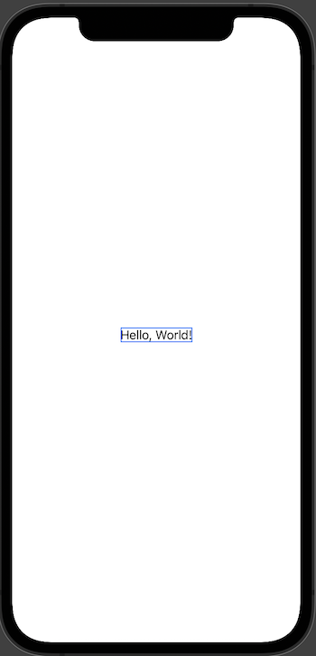
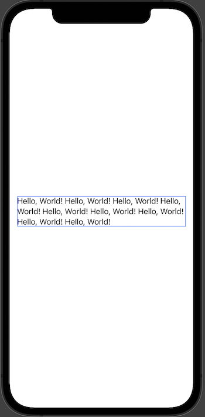
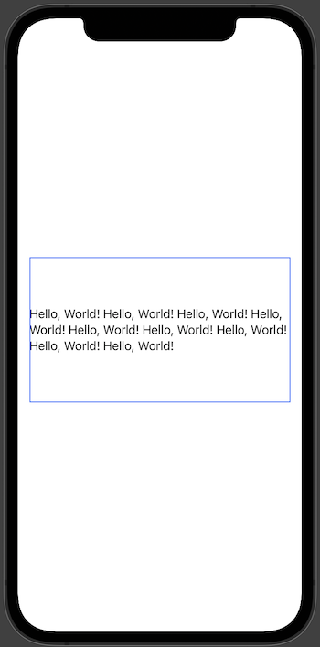
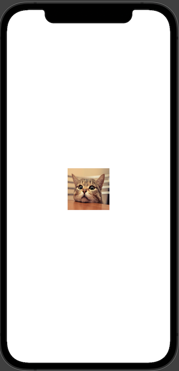
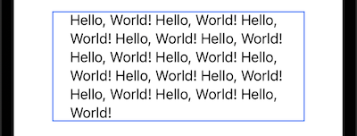
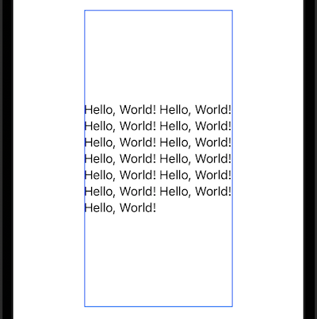
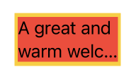
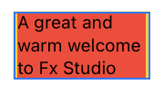
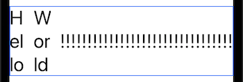
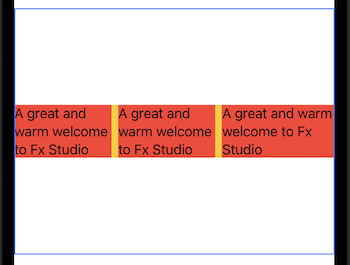

# 013.5 - Bản chất của Layout trong SwiftUI

Chào bạn đến với **Fx Studio**. Chúng ta tiếp tục hành trình bất tận với **SwiftUI**. Bài viết này sẽ trình bày khá nhiều về lý thuyết của **Bố cục giao diện** (layout) trong SwiftUI. Và đây cũng là vấn đề đau đầu nhất trong quá trình phát triển ứng dụng SwiftUI.

Lợi thế của SwiftUI đem lại cho bạn là ngay cả khi bạn không cần biết nhiều về kiến thức thì vẫn làm được. SwiftUI tự động hiểu và giúp bạn bố cục cho các View của bạn. Tuy nhiên, để bạn đạt được những thành tựu cao hơn, bạn cũng cần phải hiểu được nó.

Nếu mọi việc đã ổn rồi thì ...

> Bắt đầu thôi!

## Chuẩn bị

Về mặt tool và version, các bạn tham khảo như sau:

- SwiftUI 2.0
- Xcode 12

Về mặt kiến thức, bạn cần biết trước các kiến thức cơ bản với SwiftUI & SwiftUI App. Tham khảo các bài viết sau, nếu bạn chưa đọc qua SwiftUI:

- [Làm quen với SwiftUI](https://fxstudio.dev/swiftui-phan-1-lam-quen-voi-swiftui/)
- [Cơ bản về ứng dụng SwiftUI App](https://fxstudio.dev/swiftui-phan-2-co-ban-ve-ung-dung-swiftui-app/)

Về mặt demo, hầu như là demo đơn giản, vì tập trung vào từng view riêng lẻ. Do đó, bạn cũng không cần phải quá lo lắng và việc tạo mới project cũng không ảnh hưởng gì nhiều.

*(Mặc định, mình xem như bạn đã biết về cách tạo project với SwiftUI & SwiftUI App rồi.)*

## 1. Sự ngộ nhận

Nếu bạn là một dev iOS, thì bạn khá quen với các khái niệm như **Auto Layout** hay **Auto resizing mark** hay **frame** ... Đó là những thứ giúp bạn tạo nên bố cục của một giao diện. Bản chất của chúng là:

* Sự ràng buộc giữa các thành phần trong một giao diện.
* Sự ràng buộc giữa các thành phần cha với các thành phần con của nó.
* Xác đinh bố cục dựa theo một số thuộc tính hay kích thước cố định.

Đó chỉ là một số đặc trưng chung khi ta làm việc với UIKit mà thôi. Nôm na, việc bạn thế kế bố cục với UIKit sẽ là:

> Các View cha sẽ áp đặt cho các View con.

Bây giờ, chúng ta quay về lại SwiftUI. Bạn có nhận ra điểm khác biệt nào không? Bạn thử lấy đối tượng **Text**.

```swift
Text("Hello World!")
```

Sau đó, bạn thay đổi nội dung của nó. Chắc chắn bạn sẽ nhận ra rằng kích thước của Text sẽ tự động thay đổi, mà không chịu sự ảnh hưởng từ View cha của nó.

Do đó, trong SwiftUI

> Các đối tượng View có quyền quyết định bố cục cho bản thân chúng. Nó sẽ đề xuất kích thước và gởi lại View cho của nó.

Đó chính là sự ngộ nhận dễ xãy ra khi bạn đang là người chuyển đổi nền tảng. Vâng, quá nhiều thứ mới và không chỉ có điểm lý thuyết trên mà thôi. Tiếp theo, mình sẽ trình bày tiếp các luật của Layout trong SwiftUI.

## 2. Độ ưu tiên của Layout

Phần này sẽ trình bày về bản chất của Layout trong SwiftUI. Chúng sẽ như thế nào? Và chúng có độ ưu tiên như thế nào. Để giúp bạn có cái nhìn tổng quát. Và sẽ có những thiết kê bố cục phù hợp nhất, vì ...

> Trong SwiftUI, sự phân cấu của các View cũng chính là bố cục của giao diện của bạn.

Về độ ưu tiên trong bố cục thì chúng ta tạm thời chia ra làm 2 loại chính.

* View cơ bản (không chứa View nào khác)
* Containers (Các View có thể chứa nhiều View trong nó)

### 2.1. View cơ bản

Chúng ta sẽ bắt đầu tìm hiểu về độ ưu tiên này cho bố cục đơn giản nhất mà bạn biết được ngay từ lúc bắt đầu với SwiftUI.

```swift
import SwiftUI

struct ContentView: View {
    var body: some View {
        Text("Hello World!!!")
    }
}
```

Nhìn đoạn code trên thì nếu ta đặt **ContentView** tại lúc bắt đầu ứng dùng. Thì chúng ta sẽ hiểu rằng ContentView là `root view` của ứng dụng. Và **Text** được xem là View con & View cơ bản (theo trên).

Ta sẽ có các luật quy định cho **View** con như sau:

1. SwiftUI sẽ cung cấp khung hình với **kích thước có sẵn** (theo từng thiết bị hay kích thước được cài đặt ban đầu tại Preview) cho View cha.
2. Xác đinh View cha (**ContentView**) có một View con và nó là một View cơ bản (**Text**)
3. **ContentView** sẽ đề xuất không gian có thể hiển thị được cho **Text**. Và yêu cầu Text phải tự tính toán kích thước của bản thân nó.
4. **Text** sẽ tính toán kích thước dựa theo nội dung của nó. Sau đó, nó sẽ gởi lại cho **ContentView**.
5. Lúc này, **ContentView** đã biết được kích thước của **Text** và đặt Text vào **chính giữa** vùng hiển thị được.

Đó cũng là cách hoạt động của **Layout** trong **SwiftUI**. 

### Demo #1

Bạn hãy kiểm chứng lại bằng cách như trên. Thay đổi nội dung của Text và xem chúng hiển thị như thế nào. Bạn xem qua 2 ví dụ cơ bản sau:

* **Ví dụ 1**

```swift
struct LayoutDemo1: View {
    var body: some View {
        Text("Hello, World!")
    }
}
```

Bạn chỉ cần tạo một file SwiftUI View mới và bấm Resume để xem thôi.



* **Ví dụ 2**

```swift
struct LayoutDemo1: View {
    var body: some View {
        Text("Hello, World! Hello, World! Hello, World! Hello, World! Hello, World! Hello, World! Hello, World! Hello, World! Hello, World!")
    }
}
```



Bạn chỉ cần chú ý tới khung viền màu xanh. Nó là kích thước của **Text** và luôn là kích thước nhỏ nhất mà Text tự đề xuất. Còn khi bạn cố tính `fix` kích thước của nó thì kích thước bạn cung cấp sẽ được gởi lại View Cha. Và View cha sẽ lại tính toán và cấp phát lại cho View con.

```swift
struct LayoutDemo1: View {
    var body: some View {
        Text("Hello, World! Hello, World! Hello, World! Hello, World! Hello, World! Hello, World! Hello, World! Hello, World! Hello, World!")
            .frame(height: 200.0)
    }
}
```

Ta thêm 1 modifier `.frame` để fix height của Text. Và bạn xem kết quả nhoé!



Câu kết của phần này sẽ là

> View con luôn ở chính giữa. Ahihi!

### 2.2. Containers

Tiếp tục, chúng ta sẽ khám phá tiếp với **layout** phức tạp. Đại diện chính sẽ là các đối tượng **Stacks View**.

Bạn xem qua đoạn code sau:

```swift
import SwiftUI

struct ContentView: View {
    var body: some View {
        HStack(spacing: 16) {
            Text("Hello")
            Text("World")
            Text("!!!")
        }
        .font(.largeTitle)
    }
}
```

Chúng ta dùng `HStack` để tạo bố cụ cho View. Bây giờ, ta sẽ phám phá tiếp cách mà HStack bố cục như thế nào. (áp dụng cho cả VStack nữa)

1. Đầu tiên Stack sẽ tính toán các `spacing` (khoảng cách) giữa các items trong nó. Và Stack sẽ trừ phần đó trong không gian hiển thị có sẵn.
2. Stack sẽ chia đều không gian hiển thị đó cho tất cả các View con. Và cung cấp cho View con đầu tiên.
3. View Con cũng sẽ tự tính toán kích thước của bản thân nó và trả về cho Stack. Sau đó, Stack sẽ trừ phần không gian cấp phát cho View con đầu tiên đi và chia đều lại cho các View con còn lại.
4. Quá trình này sẽ lặp lại cho các View con tiếp theo.
5. Cuối cùng, Stack sẽ tổng hợp lại các kích thước của các View con và khoảng cách giữa chúng. Để thành kích thước của bản thân Stack. Và Stack sẽ chuyển lại kích thước lại cho View cha của nó (ContentView)

Đó là cách mà SwiftUI sẽ chia bố cục cho các Containers. Bạn sẽ thấy đôi khi kích thước của View sẽ khác nhau trong cùng một Stack.

### Demo #2

Ta sẽ demo để xem nguyên tắc trên có đúng hay không. Bắt đầu, bạn tạo một file SwiftUI View mới với bố cục HStack đơn giản thôi. 

```swift
struct LayoutDemo2: View {
    var body: some View {
        HStack {
            Text("Hello, World!")
                .background(Color.red)
            Text("Hello, World!")
                .background(Color.red)
            Text("Hello, World!")
                .background(Color.red)
        }
        .background(Color.yellow)
    }
}
```

Trong đó:

* Các Text thì giống nhau, để đảm bảo chúng có kích thước bằng nhau
* Sử dụng `.background` để tô màu cho các View con và Stack

Xem kết quả nhoé!


Quá đẹp và quá đơn giản, không khác mấy suy nghĩ của chúng ta là chúng nó sẽ chia đều. Bạn hay chú ý tới `màu vàng` đó chính là `spacing` giữa các View Con. Ta tiếp tục thay đổi đoạn code trên như sau:

```swift
    var body: some View {
        HStack {
            Text("Hello, World! Hello, World! Hello, World!")
                .background(Color.red)
            Text("Hello, World!")
                .background(Color.red)
            Text("Hello, World!")
                .background(Color.red)
        }
        .background(Color.yellow)
    }
```

Xem kết quả nhoé!


Thay đổi tiếp đoạn code trên nữa nhoé!

```swift
    var body: some View {
        HStack {
            Text("Hello, World!")
                .background(Color.red)
            Text("Hello, World! Hello, World! Hello, World!")
                .background(Color.red)
            Text("Hello, World!")
                .background(Color.red)
        }
        .background(Color.yellow)
    }
```

Kết quả nè bạn ơi!


Qua 2 thay đổi trên bạn cũng sẽ nhận ra ý nghĩa của việc:

* View con tự tính toán kích thước của nó
* Stack chia đều không gian hiển thị cho các View còn lại

Quan trọng trong luận điểm này, khi nội dung của một View vượt qua kích thước được cấp phép. Thì nó tự động thêm một dòng nữa (đối với Text). Việc này sẽ làm ảnh hưởng tới chiều kích thước mà ít gây tác động nhất đến bố cục chung.

### 2.3. Các View đặc biệt

Tuy vậy, chúng ta vẫn có một số kẻ bất tuân theo 2 quy tắc trên. Kích thước của bản thân nó không chịu sử ảnh hưởng của bất cứ ai.

Ta lấy ví dụ đó là **Image**. SwiftUI sẽ lấy `size` thực tế của ảnh và xem nó là kích thước của Image và sẽ đề xuất cho View Cha. Bạn xem ví dụ nha.

```swift
    var body: some View {
        Image("cat")
            .frame(width: 100.0, height: 100.0)
    }
```

Bạn xem kết quả nhoé!


Bạn sẽ lấy khung hình viền màu xanh quen thuộc, đó là kích thước cho Image và mình fix cố định. Tuy nhiên, Image vẫn hiển thị tràn ra ngoài. Đây là một trong những trường hợp đặc biệt mà thôi. Muốn cho nó vào khuôn khổ chung thì chúng ta cần phải dùng tới các `modifier` thay đổi thuộc tính.

```swift
.resizable()
```

Dễ thương lại rồi nè!



## 3. Các yếu tố ảnh hưởng tới Layout & độ ưu tiên

Ông bà ta có câu nói:

> Đời không như là mơ.

Mặc dùng Layout trong SwiftUI hoạt động theo các luật như trên. Nhưng lại có một số thành phần có thể phá vỡ luật lệ đó. Chúng ta sẽ tìm hiểu tiếp những thứ góp phần thay đổi tới Layout nha.

### 3.1. frame

Yếu tố đầu tiên chính là sự ảnh hưởng của `frame` tới chính đối tượng View đó.

* **Mặc kệ nội dung của đối tượng và hiển thị với kích thước được cung cấp**

```swift
    var body: some View {
        Text("Hello, World! Hello, World! Hello, World! Hello, World! Hello, World! Hello, World! Hello, World! Hello, World! Hello, World! Hello, World! Hello, World! Hello, World! Hello, World!")
            .frame(width: 300.0, height: 100.0)
    }
```

Ta sẽ quy định kích thước cố định cho Text là `300 x 100`. Lúc này mặc dù nội dung Text nó sẽ lớn hơn kích thước đó. Nhưng kích thước đề xuất lên View cha sẽ là `300 x 100`. Bạn sẽ thấy có dấu `...` cho Text.

Xem hình nhoé!


* **Sẽ ưu tiên một chiều kích thước nào đó**

Nếu bạn muốn giới hạn kích thước với một chiều kích thước, thì nó sẽ được ưu tiên. Chiều còn lại sẽ tính toán để chứa vừa nội dung của View. Xem ví dụ code nhoé

```swift
    var body: some View {
        Text("Hello, World! Hello, World! Hello, World! Hello, World! Hello, World! Hello, World! Hello, World! Hello, World! Hello, World! Hello, World! Hello, World! Hello, World! Hello, World!")
            .frame(width: 300.0)
    }
```

Ta chỉ cần khai báo mỗi `width` còn `height` sẽ tự động tính toán để phù hợp. Xem tiếp kết quả hiển thị nhoé!




* **Đặt ra giới hạn `min` & `max` cho mỗi chiều kích thước**

Đó chính là xác định kích thước có thể thay đổi theo phạm vị cho phép. Bạn cung cấp `min` & `max` hoặc 1 trong 2 cũng được. Cho 1 chiều hoặc cả 2 chiều.

```swift
    var body: some View {
        Text("Hello, World! Hello, World! Hello, World! Hello, World! Hello, World! Hello, World! Hello, World! Hello, World! Hello, World! Hello, World! Hello, World! Hello, World! Hello, World!")
            .frame(maxWidth: 200.0, maxHeight: 400.0)
    }
```

Với ví dụ trên thì bạn sẽ thấy `width` không đước phép vượt `max` của nó. Nên nội dung sẽ vừa khít chiều `width`. Với `height` thì mặc dù nội dung chưa đủ, nhưng kích thước vẫn xác định theo `max`. Xem hình kết quả nhoé!




### 3.2. Thứ tự các modifier

Cái này quá kinh điển rồi. Nếu bạn đã từng vọc SwiftUI thì cũng khá thấm thía nó.

> Thứ tự của các modifier cho một View sẽ quyết định tới hiển thị của View đó như thế nào.

Trong đó:

* Layout & kích thước cũng bị ảnh hưởng
* Khi hoán đổi các modifier cho cùng 1 View thì bạn sẽ nhận được 2 hiển thị khác nhau.

Nguyên nhân là

> Với SwiftUI, View là kiểu tham trị (Struct) nên mỗi lần sử dụng modifier sẽ tạo ra một phiên bản mới của View. Phiên bản đó sẽ thay thế phiên bản trước.

Còn bây giờ, chúng ta lại xem thông qua các ví dụ code thôi.

* Ví dụ 1

```swift
    var body: some View {
        Text("A great and warm welcome to Fx Studio")
          .background(Color.red)
          .padding()
    }
```


* Ví dụ 2

```swift
    var body: some View {
        Text("A great and warm welcome to Fx Studio")
          .padding()
          .background(Color.red)
    }
```


Chỉ cần hoán vị chúng nó là đủ thấy sự khác nhau rồi. Hi vọng bạn sẽ cẩn thận hơn khi sử dụng các modifiers.

### 3.3. Biến đổi bản chất

Ở ví dụ với đối tượng Image. Bạn đã thấy sự thay đổi bản chất của Image bằng modifier `.resizable()`. Nó giúp nội dung của Image sẽ phù hợp với kích thước được đề xuất cho nó.

Thì SwiftUI cũng có nhiều modifier mà tác động tới bản chất của đối tượng View. Từ đó, sẽ thay đổi kích thước mà View sẽ đề xuất. Hoặc thay đổi nội dùng của View để phù hợp với kích thước được đề xuất.

Ta xem qua ví dụ sau nhoé

```swift
    var body: some View {
        Text("A great and warm welcome to Fx Studio")
          .background(Color.red)
          .frame(width: 100, height: 50, alignment: .center)
          .background(Color.yellow)
    }
```

Chúng ta dùng 2 lần `.background` với 2 màu khác nhau để xem kích thước của nội dùng và kích thước sau khi fix kích thước. Với kết quả code của ví dụ trên thì nội dung sẽ vượt quá kích thước và hiện ra `...`



Bạn sẽ thêm thuộc tính mà gây biến đổi nội dung của Text là `.minimumScaleFactor(0.5)`. Xem code sau khi chỉnh sửa

```swift
    var body: some View {
        Text("A great and warm welcome to Fx Studio")
          .background(Color.red)
          .frame(width: 100, height: 50, alignment: .center)
          .minimumScaleFactor(0.5)
          .background(Color.yellow)
    }
```

Kết quả nhoé!



Lúc này, nội dùng vừa đảm bảo hiển thị đầy đủ và vừa đúng kích thước đã cho rồi nha.

### 3.4. layoutPriority

Đây chính xác là cái mà chúng ta cần nhớ và cần nên sử dụng. Hoặc khi chúng ta quá mệt mỏi với việc ghi nhớ thứ thự cũng như sự biến đổi của các modifier gây ra cho View. Thì bạn chỉ cần

> Quy định trực tiếp độ ưu tiên của Layout cho từng View.

Đó là modifier `..layoutPriority(:_)`. Tham số truyền vào là một số `Int` và xét theo chiều tăng như `-1 < 0 < 1`.

Chúng ta thực hành thôi, ta có đoạn code sau cho Stack.

```swift
    var body: some View {
        HStack(spacing: 16) {
            Text("Hello")
            Text("World")
            Text("!!!!!!!!!!!!!!!!!!!!!!!!!!!!!!!!")
        }
        .font(.largeTitle)
    }
```

Kết quả hiện thị dựa theo nguyên tắc cho Layout ở trên. Bạn xem kết quả nhoé!


Bạn tiếp tục với việc thêm modifier `.layoutPriority` vào Text của Stack nha.

```swift
    var body: some View {
        HStack(spacing: 16) {
            Text("Hello")
            Text("World")
            Text("!!!!!!!!!!!!!!!!!!!!!!!!!!!!!!!!")
                .layoutPriority(1)
        }
        .font(.largeTitle)
    }
```

Kết quả hiển thị sẽ thay đổi và ưu tiên cho View có độ ưu tiên cao nhất trước.Kể cả kích thước của Stack cũng sẽ bị ảnh hưởng theo. Xem hình nhoé!



Ta thay đổi thêm lần cuối, biến đổi bản chất của cả Stack luôn, với modifier `..lineLimit(1)` 

```swift
    var body: some View {
        HStack(spacing: 16) {
            Text("Hello")
            Text("World")
            Text("!!!!!!!!!!!!!!!!!!!!!!!!!!!!!!!!")
                .layoutPriority(1)
        }
        .font(.largeTitle)
        .lineLimit(1)
    }
```

Mặc dù như vậy nhưng View có độ ưu tiên cao nhất vẫn là ưu tiên cao nhất. Bạn xem hình kết quả nhoé!


### 3.5. Bản chất Stack

Cái này cũng ít bạn để ý, Vì bản chất của mỗi Stack là khác nhau, chúng bố cục nội dung của các View trong đó sẽ khác nhau. Bạn cần hiểu được chúng. Khi đó sẽ chọn ra những modifier phù hợp cho việc layout nội dung.

Như với:

* **HStack**

Các View con của nó sẽ được bố cục theo chiều ngang. Do đó, kích thước `width` sẽ quyết định tới kích thước hiển thị của các View con và Stack hơn là chiều `height`.

Khi nội dung của View con vượt quá `width` cấp phát thì `height` sẽ tự động kéo dài ra.

* **VStack**

Còn với VStack thì ngược lại. Vì các view con sẽ được bố cục theo chiều dọc. Do đó, `height` mới mang ý nghĩa quyết định. Nhưng vẫn chịu sự ảnh hưởng của `width` tác động tới các View Con trong đó. Có thể nói là sự kết hợp của cả 2.

Bạn xem ví dụ cho trường hợp này nha. Ta sẽ dùng HStack với code ban đầu như sau:

```swift
    var body: some View {
        HStack {
            Text("A great and warm welcome to Fx Studio")
                .background(Color.red)
            Text("A great and warm welcome to Fx Studio")
                .background(Color.red)
            Text("A great and warm welcome to Fx Studio")
                .background(Color.red)

        }
        .background(Color.yellow)
    }
```

Xem kết quả hiển thị nhoé. Cái này là chân phương không can thiệp gì hết.


Tiếp theo, ta sẽ thêm `frame` với chiều `height`.

```swift
    var body: some View {
        HStack {
            Text("A great and warm welcome to Fx Studio")
                .background(Color.red)
            Text("A great and warm welcome to Fx Studio")
                .background(Color.red)
            Text("A great and warm welcome to Fx Studio")
                .background(Color.red)

        }
        .background(Color.yellow)
        .frame(height: 300)
    }

```

Bạn xem tiếp kết quá nhoé. Mặc dùng kích thước của Stack đã tăng lên, nhưng nội dung bên trong View con vẫn thế.



Cuối cùng, bạn hãy đổi `height` thành `width` để xem chiều quyết định này ảnh hưởng tới giao diện như thế nào nha. 

```swift
    var body: some View {
        HStack {
            Text("A great and warm welcome to Fx Studio")
                .background(Color.red)
            Text("A great and warm welcome to Fx Studio")
                .background(Color.red)
            Text("A great and warm welcome to Fx Studio")
                .background(Color.red)

        }
        .background(Color.yellow)
        .frame(width: 300)
    }
```

Xem kết quả nhoé!


Đẹp rồi nhoé! Mọi thứ đã đúng ý đồ.

## Tạm kết

* Tìm hiểu được bản chất Layout trong SwiftUI
* Tìm hiểu về cách Layout hoạt động cho 2 đối tượng cơ bản trong SwiftUI, là View Cơ bản & Containers
* Xác định được các yếu tổ ảnh hưởng tới độ ưu tiên trong Layout
* Ta có 2 yếu tố ảnh hướng chính tới độ ưu tiên trong Layout
  * Modifier làm thay đổi hành vi và bản chất của View
  * Độ ưu tiên của Layout, quan trọng nhất là `.layoutPriority`

Ngoài ra, còn rất nhiều yếu tố khác ảnh hưởng tới Layout mà mình chưa liệt kê hay chưa tìm hiểu tới được. Nếu thu lượm thêm kiến thức nữa thì mình sẽ bổ sung vào bài viết này.

---

Cảm ơn bạn đã theo dõi các bài viết từ **Fx Studio** & hãy truy cập [website](https://fxstudio.dev/) để cập nhật nhiều hơn!

