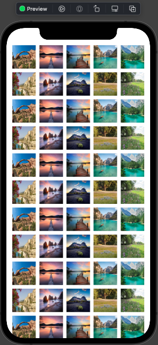
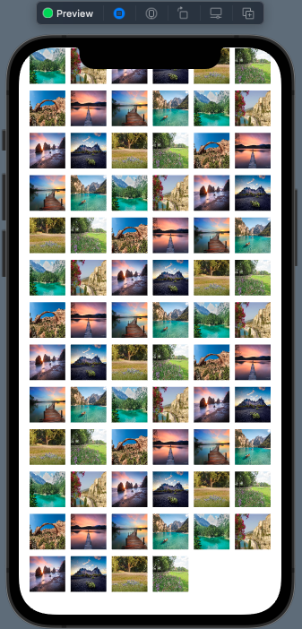

# 02 - Grid Item

Chào mừng bạn đến với **Fx Studio**. Chúng ta lại tiếp tục với vũ trụ **SwiftUI** bất tận này. Bài viết này sẽ tiếp tục về thiết kế giao diện với bố cục **Grid Layout**. Chủ đề là **GridItem**, cách bạn sắp xếp bố cục các phần tử trong một Grid.

Nếu bạn chưa biết về Grid Layout trong SwiftUI, thì có thể tìm đọc lại bài viết trước. Còn nếu mọi việc đã ổn rồi, thì ...

> Bắt đầu thôi!

## Chuẩn bị

Về mặt tool và version, các bạn tham khảo như sau:

- SwiftUI 2.0
- Xcode 12

Về mặt kiến thức, bạn cần biết trước các kiến thức cơ bản với SwiftUI & SwiftUI App. Tham khảo các bài viết sau, nếu bạn chưa đọc qua SwiftUI:

- [Làm quen với SwiftUI](https://fxstudio.dev/swiftui-phan-1-lam-quen-voi-swiftui/)
- [Cơ bản về ứng dụng SwiftUI App](https://fxstudio.dev/swiftui-phan-2-co-ban-ve-ung-dung-swiftui-app/)

*(Mặc định, mình xem như bạn đã biết về cách tạo project với SwiftUI & SwiftUI App rồi.)*

## GridItem

**GridItem** là mô tả cho một ô lưới (*a single grid*) trong một *Grid Layout*, chẵng hạn như một hàng (*row*) hoặc một cột (*column*).

> Dễ hiểu hơn thì nó như là **config** cho LazyHGrid hoặc LazyVGrid.

Tùy thuộc, đối tượng mà bạn sử dụng là **LazyVGrid** hay **LazyHGrid** mà các **GridItem** sẽ đại diện cho cột hay hàng. Và config này cần một mãng các GridItem để định nghĩa bố cục, không phải là 1 GridItem riêng lẻ. Điều này bạn đã được trải nghiệm trong bài viết trước rồi. 

Ví dụ như là:

```swift
private var gridItemLayout = [GridItem(.fixed(80), spacing: 8),
                                  GridItem(.fixed(80), spacing: 8),
                                  GridItem(.fixed(80), spacing: 8)]
```

Các **GridItem** sẽ định nghĩa kích thước, hành vi, khoảng cách, căn chỉnh ... cho các ô trong **Grid**. Và các **GridItem** trong array sẽ kiểm soát số lượng hàng hay cột của **Grid**.

Ngoài ra, các GridItem còn nhận một đối số là **GridItemSize**. Đây là một đối số bắt buộc bạn phải cung cấp, nó sẽ có nhận 1 trong 3 giá trị:

* **flexible**
* **adaptive**
* **fixed**

Và cũng chính từ đó, bạn sẽ có được những giao diện Grid Layout tương ứng theo. Hoặc bạn có thể kết hợp chúng để tạo ra các layout phức tạp hơn nữa.

## Flexible

```swift
GridItem(.flexible())
```

**Flexible** là các mà bạn muốn xác định cụ thể Grid của bạn sẽ có là bao nhiêu **cột** hoặc bao nhiêu **hàng**, tương ứng với **LazyVGrid** hoặc **LazyHGrid**.

### Create

Chúng ta hãy lấy một ví dụ đơn giản nhóe. Bạn tham khảo đoạn code sau:

```swift
struct FlexibleGridDemo: View {
    
    private var gridConfig = [
        GridItem(.flexible(), spacing: 10),
        GridItem(.flexible(), spacing: 10),
        GridItem(.flexible(), spacing: 10)
    ]
    
    var body: some View {
        ScrollView {
            LazyVGrid(columns: gridConfig, spacing: 10) {
                ForEach((0...99), id: \.self) { index in
                    Image("img\(index % 10)")
                        .resizable()
                        .aspectRatio(1.0, contentMode: .fill)
                }
            }
            .padding(.horizontal)
        }
        .frame(maxHeight: .infinity)
    }
}
```

Trong đó:

* `gridConfig` ta tạo sẵn 3 đối tượng **GridItem**. Điều này có nghĩa chúng ta sẽ có 3 cột với **LazyVGrid**.
* Phần hiển thị LazyVGrid thì vẫn bình thường (như bài viết trước)

Qua đó, bạn chỉ cần tập trung vào số lượng phần tử cho `gridConfig` là bao nhiêu phần tử. Từ đó, bạn chủ động quyết định được giao diện của Grid sẽ theo ý bạn với `.flexible`


Kết quả ban đầu sẽ như vậy.

### Columns or Row

Để thấy được sự thay đổi giao diện từ việc số lượng của array **GridItem**, thì ta sẽ thay đổi code như sau:

```swift
    private var gridConfig = [
        GridItem(.flexible(), spacing: 10),
        GridItem(.flexible(), spacing: 10),
        GridItem(.flexible(), spacing: 10),
        GridItem(.flexible(), spacing: 10),
        GridItem(.flexible(), spacing: 10)
    ]
```

Như vậy, bạn sẽ có một Grid từ 3 cột thành Grid có 5 cột, tương ứng với array `gridConfig` có tổng số phần tử là `5`. Quá đơn giản phải không nào. Bấm Resume và xem kết quả tiếp theo nhóe.



### minimum & maximum

Bạn có thể quyết định thêm kích thước cho một GridItem với `.flexible` thông qua 2 tham số là:

* **minimum**
* **maximum**

Giúp cho bạn xác định kích thước nhỏ nhất và lớn nhất. Bạn vẫn có thể cung cấp 1 trong 2 tham số vẫn được. Không cần cung cấp hết cho tất cả các phần tử trong array.

Chúng ta xem qua ví dụ code là hiểu liền à.

```swift
    private var gridConfig = [
        GridItem(.flexible(), spacing: 10),
        GridItem(.flexible(), spacing: 10),
        GridItem(.flexible(minimum: 100), spacing: 10),
        GridItem(.flexible(), spacing: 10),
        GridItem(.flexible(), spacing: 10)
    ]
```

Cột thứ 3 sẽ có kích thước nhỏ nhất là `100px`. Các cột còn lại sẽ được tính toán lại kích thước sao cho phù hợp. Bấm **Resume** và xem kết quả nha.


Bạn để ý kĩ thì sẽ thấy, 2 cột bên phải có kích thước bé hơn 2 cột bên trái. Điều này xãy ra vì bản chất của layout trong SwiftUI sẽ tính toán kích thước lần lượt từ phần tử đầu tiên. Sau khi đã trừ hết các kích thước cố định (fix & spacing), các kích thước còn lại sẽ được chia đều cho các phần tử còn lại ... Lần lượt sẽ được cấp phát hết. *(nghe hơi rối phải không ... ahihi!)*

## Fixed

Khi bạn chán với việc kích thước của item cứ không theo ý của bạn. Mọi việc sẽ đơn giản nếu bạn xác định luôn 1 kích thước cố định cho item. Thì hãy tạo GridItem với `.fixed`. Và bạn cần cung cấp cho nó 1 con số để xác định kích thước cố định.

Xem ví dụ code nhóe.

```swift
struct FixedGridDemo: View {
    private var gridConfig = [
        GridItem(.fixed(100)),
        GridItem(.fixed(100)),
        GridItem(.fixed(100))
    ]
    
    var body: some View {
        ScrollView {
            LazyVGrid(columns: gridConfig, spacing: 10) {
                ForEach((0...99), id: \.self) { index in
                    Image("img\(index % 10)")
                        .resizable()
                        .aspectRatio(1.0, contentMode: .fill)
                }
            }
            .padding(.horizontal)
        }
        .frame(maxHeight: .infinity)
    }
}
```

Trong đó:

* Tổng số cột là 3, tương ứng với tổng item trong array GridItem là 3
* Kích thước mỗi phần tử là `100px`

Bấm Resume và xem kết quả nha!


Bạn thử tăng số lượng item với mục đích cho kích thưởng tổng các item lơn hơn kích thước màn hình sẽ trông như thế nào nhóe.

```swift
    private var gridConfig = [
        GridItem(.fixed(100)),
        GridItem(.fixed(100)),
        GridItem(.fixed(100)),
        GridItem(.fixed(100)),
        GridItem(.fixed(100))
    ]
```


Không ngoài dự án, chúng sẽ tràn ra ngoài ScrollView. Vì kích thước lúc này của tổng GridItem lớn hơn kích thước màn hình rồi. Chúng ta cần thay đổi ScrollView một tí, để xem được các phần bị tràn kia. Code ví dụ như sau:

```swift
        ScrollView([.horizontal, .vertical]) {
            LazyVGrid(columns: gridConfig, spacing: 10) {
                ForEach((0...99), id: \.self) { index in
                    Image("img\(index % 10)")
                        .resizable()
                        .aspectRatio(1.0, contentMode: .fill)
                }
            }
            .padding(.horizontal)
        }
        .frame(maxHeight: .infinity)
```

Bạn chỉ cần thêm tham số với `[.horizontal, .vertical]`, thì ScrollView sẽ hoạt động với việc scroll 2 chiều. Lúc này, tự động kích thước sẽ được hiển thị đầy đủ và người dùng chỉ việc scroll để xem hết thôi.


## Adaptive

Khi bạn không biết trước số lượng hàng hay cột. Chỉ đơn giản là muốn các Item tự động lấp đầy hết Grid của bạn. Thì sử dụng GridItem với `.adaptive` sẽ giúp bạn rất nhiều. Bạn sẽ cần cung cấp thêm tham số `minimum` hoặc `maximum` cho chúng. Còn lại **SwiftUI** sẽ tự động giúp bạn xác định số lượng và kích thước của các item trong Grid.

> Điều này rất có ích khi bạn sử dụng các nguồn dữ liệu động, như từ API ...

Xem ví dụ code nhóe!

```swift
struct AdaptiveGridDemo: View {
    private var gridConfig = [
        GridItem(.adaptive(minimum: 50))
    ]
    
    var body: some View {
        ScrollView {
            LazyVGrid(columns: gridConfig, spacing: 10) {
                ForEach((0...99), id: \.self) { index in
                    Image("img\(index % 10)")
                        .resizable()
                        .aspectRatio(1.0, contentMode: .fill)
                }
            }
            .padding(.horizontal)
        }
        .frame(maxHeight: .infinity)
    }
}
```

Trong đó:

* Bạn sẽ thấy chỉ cần 1 phần tử GridItem với `.adaptive` duy nhất trong array là được.
* SwiftUI sẽ tự động xác định và ráp đầy đủ các item vào Grid

Với `.adaptive` thì mọi việc đã đơn giản thì càng đơn giản hơn nữa. EZ game!



Tuy nhiên, bạn vẫn có thể tạo thêm nhiều GridIem `.adaptive` trong array config kia. Ví dụ như sau:

```swift
    private var gridConfig = [
        GridItem(.adaptive(minimum: 50)),
        GridItem(.adaptive(minimum: 80)),
        GridItem(.adaptive(minimum: 30))
    ]
```

Chúng ta sử dụng các kích thước khác nhau. Giao diện lúc này sẽ khá là ảo ma lazada.


Đây cũng là nhược điểm của SwiftUI, khi chúng nó tự động tính toán và đề xuất kích thước. Hầu như bạn sẽ không kiểm soát được. Ahuhu!

## Mixing

Khi bạn kết hợp các loại **GridItem** với nhau để có được một Grid với các kích thước cho các item thay đổi. Hay còn gọi là trộn các GridItem lại (***mixing***).

Xem ví dụ code nhóe!

```swift
struct MixingGridDemo: View {
    
    private var gridConfig = [
        GridItem(.fixed(150)),
        GridItem(.adaptive(minimum: 50))
    ]
    
    var body: some View {
        ScrollView {
            LazyVGrid(columns: gridConfig, spacing: 10) {
                ForEach((0...99), id: \.self) { index in
                    Image("img\(index % 10)")
                        .resizable()
                        .frame(height: 50)
                        .scaledToFit()
                }
            }
            .padding(.horizontal)
        }
        .frame(maxHeight: .infinity)
    }
}
```

Trong đó:

* Mỗi hàng sẽ được xác định bằng số lượng **GridItem** trong array config
* Phần tử đầu tiên là `.fixed`, có nghĩa là kích thước cố định và được ưu tiên đầu tiên
* Phần tử tiếp theo là `.adaptive`, có nghĩa là các item lần lượt sẽ ráp vào trong hàng đó. Cho tới khi không còn khoảng trống để thêm item nữa.

Phù hợp khi cho bạn muốn nhất mạnh việc chú ý tới một item cụ thể nào đó. Thôi, bấm **Resume** để xem kết quả nào.


## Default

Hoặc đôi khi bạn lười quá, không muốn sài loại gì cho **GridItem** hết. Cứ đề default như thế này `GridItem()`. Code ví dụ như sau:

```swift
    private var gridConfig = [
        GridItem()
    ]
```

Kết quả như sau:


*(Hình bóng List quen thuộc nhóe!)*

Bạn thử thêm 1 **GridItem** nữa thì xem sao.

```swift
    private var gridConfig = [
        GridItem(),
        GridItem()
    ]
```

Kết quả như sau:


Do đó, bạn sẽ thấy một điều rằng: mọi thứ hoạt động tự động & các kích thước cho các item cũng tự động được tính toán. Chúng ta không cần quá suy nghĩ nhiều.

> Thế giới đã có **SwiftUI** lo rồi!

EZ Game!

## Tạm kết

* Biết về nhiều kiểu khởi tạo một GridItem
* Ý nghĩa của array GridItem và sự ảnh hưởng của nó cho Grid Layout
* Kết hợp giữa các loại GridItem với nhau để tạo nên một Grid Layout có giao diện phức tạp

---

Cảm ơn bạn đã theo dõi các bài viết từ **Fx Studio** & hãy truy cập [website](https://fxstudio.dev/) để cập nhật nhiều hơn
